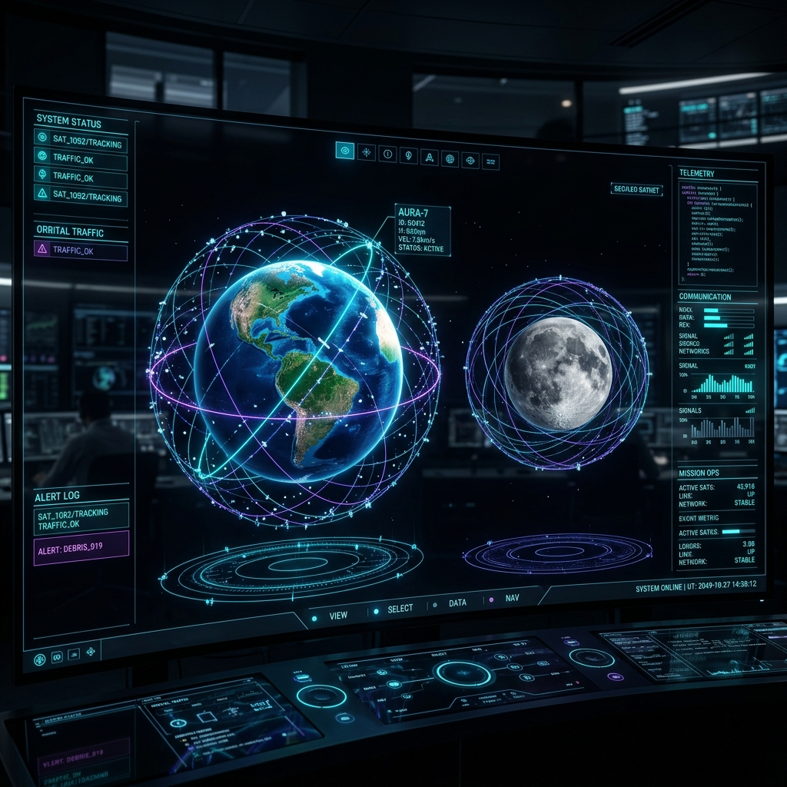

# 📡 Orbitim 3D - Gerçek Zamanlı Uydu ve Çoklu Gök Cismi Telemetri Simülatörü

<p align="center">
  
</p>

---

## 🌌 Proje Hakkında

**Orbitim 3D**, Dünya ve Ay yörüngelerindeki yapay uydu kabuklarını, enkaz bulutlarını ve ünlü takımyıldızları (Starlink, GPS vb.) gerçek zamanlı yörünge mekaniği formülleri ve TLE (Two-Line Element) verilerini kullanarak simüle eden siber-estetik bir telemetri istasyonudur. 

Tümüyle WebGL/ThreeJS üzerinde koşan bu platform, saniyede 12.000'den fazla uydunun yörüngesini hesaplarken performanstan ödün vermeden **60 FPS** akıcı bir astronomik gözlem deneyimi sunar.

---

## ⚡ Son Yapılan Geliştirmeler ve Yeni Özellikler

Sisteme entegre edilen en son nesil siber komuta merkezi özellikleri:

*   **🌕 Çoklu Gök Cismi Gözlem Modu (Multi-Body Observation)**:
    *   Sistem artık sadece Dünya'yı değil, aynı zamanda **3D Ay Küresini (Moon Globe)** de gözlemlemeyi destekler.
    *   Ay moduna geçildiğinde merkez küre kraterli Ay dokusunu yükler, Ay'ın atmosferi olmadığı için mavi ışıma devredışı kalır ve gökyüzünde dönen cisim olarak **3D parıldayan mavi Dünya (Blue Marble)** belirir.
    *   Ay yörüngesinde dönen meşhur uydular (**Lunar Reconnaissance Orbiter (LRO)**, **Lunar Gateway (NRHO)**, **Artemis II Orion**, **Apollo 11 Komuta Modülü** ve **Chang'e 4**) Keplerian dairesel yörüngeleriyle simüle edilir.
*   **🏎️ 60 FPS Delta-Time Warp Hızlandırma (Time Machine)**:
    *   Simülasyon saati ThreeJS çizim döngüsündeki delta farklarına göre güncellenir.
    *   `1x`, `10x`, `60x` ve `300x` warp hızları seçildiğinde, tüm uydular yörüngelerinde atlamadan, pürüzsüz ve sürekli olarak kayarak uçarlar.
    *   `SYNC LIVE` butonu ile simülasyon saati anında yerel saate geri eşitlenebilir.
*   **🚨 Enkaz Çarpışma Erken Uyarı Sistemi (Debris Alert Ticker)**:
    *   Uluslararası Uzay İstasyonu (ISS) ile uzaydaki binlerce enkaz parçası (Cosmos, Fengyun vb.) arasındaki 3D mesafe her 5 saniyede bir milimetrik olarak hesaplanır.
    *   Riskli yakınlaşmalarda HUD ekranında siber kırmızı renkte yanıp sönen bir erken uyarı tıkırı belirir (örn. `COLLISION RISK DETECTED: ISS vs FENGYUN-1C DEBRIS | Close Approach: 342.1 km`).
*   **⏸️ & ▶️ Müzik Çalar Tarzı Oynat/Durdur Butonları**:
    *   Zaman akışını donduran kırmızı vurgulu `DURDUR` butonu ile simülasyonu devam ettiren yeşil vurgulu `OYNAT` butonu yan yana yerleştirildi.
*   **🔍 Akıllı Kamera Yakınlaştırma Sınırları**:
    *   Kameranın Dünya/Ay yüzeyinin içerisine girmesini önleyen `minDistance (115)` ile derin uzayda kürenin kaybolmasını önleyen `maxDistance (320)` OrbitControls sınırları yerleştirildi.
*   **🖱️ İnteraktif Sky Raycasting (Doğrudan Tıklama ile Uçuş)**:
    *   Gözlem modundayken gökyüzünde süzülen Ay veya Dünya'ya doğrudan mouse ile tıklayarak kamera geçişi yapabilir ve gök cisimlerini yer değiştirebilirsiniz.

---

## 🌟 Çekirdek Özellikler

*   **⚡ Satvisor TLE CDN Aynası**: CelesTrak 403 limitlerini aşarak **12.000+ aktif uyduyu** anında yükleyen hızlı yörünge veri hattı.
*   **🌍 8K Ultra Yüksek Çözünürlüklü Dünya**: Gündüz ve gece (şehir ışıkları) dokularını birleştiren özel `MeshStandardMaterial` materyali.
*   **☁️ Bağımsız Bulut Katmanı**: Dünya'nın üzerinde, ondan bağımsız olarak dönen gerçekçi bulut simülasyonu.
*   **🚀 LOD (Level of Detail) Performans Optimizasyonu**:
    *   Uyduların donma yapmasını önlemek için basitleştirilmiş neon parçacıklar ve ortak materyal havuzu (material cache) kullanılır.
    *   Sadece üzerine tıklanarak kilitlenen (hedef alınan) aktif uydu yörünge çizgisi ve kapsama alanı halkasıyla birlikte gösterilir.
*   **💫 Yaşayan Takımyıldız Blinki**: Tüm uydu parçacıkları kendilerine özel rastgele fazlarda out-of-phase olarak sinüs dalgasıyla yanıp söner.

---

## 🛠️ Kullanılan Teknolojiler

*   **Frontend Framework**: React 19 + TypeScript
*   **Vite**: v8.1 (Fast HMR & Optimized Bundling)
*   **3D WebGL Engine**: Three.js & `react-globe.gl` / `globe.gl`
*   **Fizik & Orbital Hesaplama**: `satellite.js` (SGP4/SDP4 Orbit Propagator)
*   **Styling**: Tailwind CSS v4 + Lucide React (Cyberpunk Glassmorphic HUD)

---

## 🚀 Kurulum ve Çalıştırma

Projeyi yerel makinenizde çalıştırmak için aşağıdaki adımları izleyin:

1.  **Bağımlılıkları Yükleyin**:
    ```bash
    npm install
    ```

2.  **Geliştirme Sunucusunu Başlatın**:
    ```bash
    npm run dev
    ```

3.  **Tarayıcıda Açın**:
    Tarayıcınızda `http://localhost:5173/` adresine gidin.

4.  **Üretim Sürümü İçin Derleyin**:
    ```bash
    npm run build
    ```

---

## 🖱️ Kontroller

*   **Dünya/Ay Döndürme**: Sol tık ile sürükleyin.
*   **Yakınlaştırma/Uzaklaştırma**: Farenizin tekerleğini kullanın (Gelişmiş sınırlar dahilinde).
*   **Uydu Telemetrisi Kilitleme**: Herhangi bir uydunun üzerine tıklayarak yörüngesini ve anlık enlem/boylam/hız bilgilerini HUD panelinde kilitleyin.
*   **Gök Cismi Değiştirme**: Sol paneldeki hedeflerden `EARTH` / `MOON` seçin veya gökyüzündeki Ay/Dünya mesh'ine doğrudan mouse ile tıklayın.
*   **Zaman Kontrolleri**: Kontrol panelinden hızı bükün, dondurun veya canlı zamana senkronize edin.
